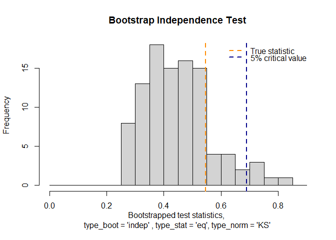
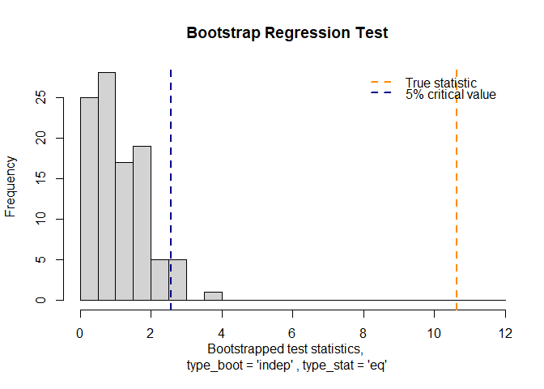
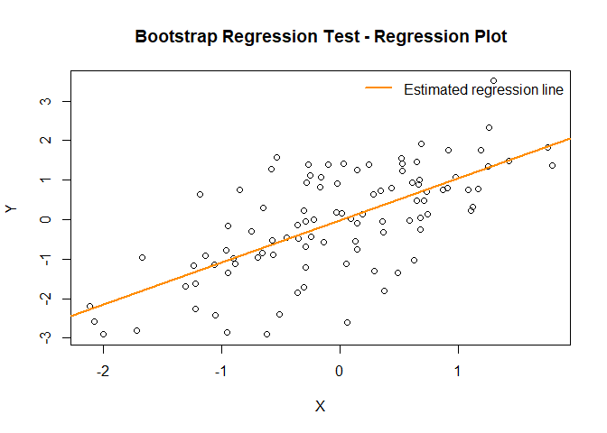
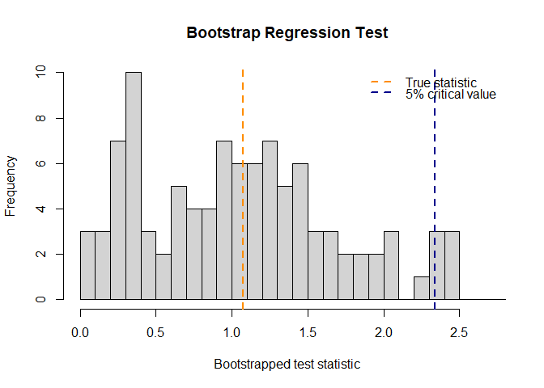
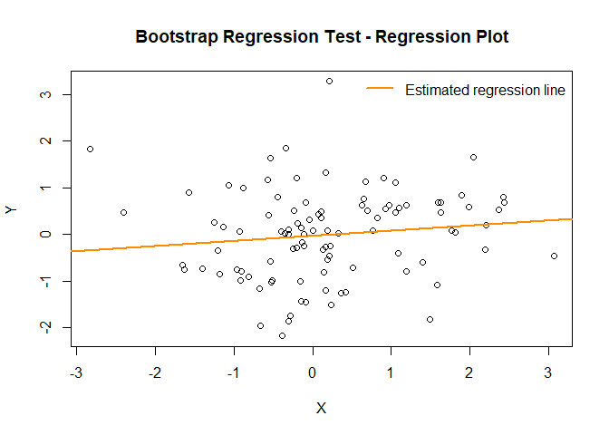
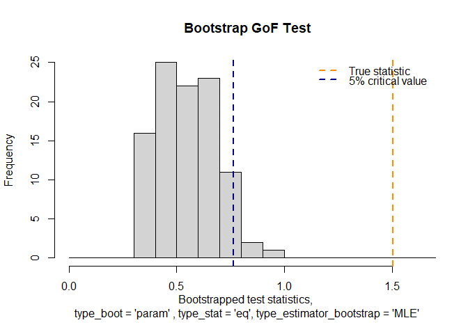

<!-- README.md is generated from README.Rmd. Please edit that file -->

# Package BootstrapTests

This package BootstrapTests implements several methods to perform
bootstrap-based hypothesis testing procedures on three statistical
problems: independence testing, testing the slope in a linear regression
setting, and goodness-of-fit testing.

## Installation

You can install the development version of BootstrapTests from
[GitHub](https://github.com/) using the `devtools` package with:

``` r
# install.packages("devtools")
devtools::install_github("AlexisDerumigny/BootstrapTests")
```

## Examples

The following three subsections will showcase the use of the
‘BootstrapTests’ package for the independence hypothesis testing,
testing whether or not the slope is zero in a linear regression setting,
and goodness-of-fit testing. In particular, we will show the use of the
functions that implement these:

- `perform_independence_test.R`
- `perform_regression_test.R`
- `perform_GoF_test.R`

### Independence testing

We perform a hypothesis test of statistical independence by means of
bootstrapping. The null hypothesis is that of independence between the
two random variables, versus the alternative of dependence between them.
This procedure gives a total of 8 combinations of bootstrap resampling
schemes (nonparametric and independent), test statistics (centered and
equivalent), and Kolmogorov-Smirnov or L2-type of true test statistic.
This function gives the corresponding p-values, the true test statistic
and the bootstrap-version test statistics. The default (and valid)
method implemented in this function is the null bootstrap, together with
the equivalent test statistic and Kolmogorov-Smirnov test statistic. Via
the `bootstrapOptions` argument, the user can specify other bootstrap
resampling schemes and test statistics.

``` r
library(BootstrapTests)
n <- 100

# Under H1
X1 <- rnorm(n)
X2 <- X1 + rnorm(n)
result <- perform_independence_test(
  X1, X2, nBootstrap = 100,
  bootstrapOptions = list(type_boot = "indep",
                          type_stat = "eq",
                          type_norm = "KS") )
print(result)
#>          🎯Bootstrap Independence Test Results🎯
#>  ===================================================== 
#> 
#> Performed test:
#>   Bootstrap type           : indep
#>   Bootstrap repetitions    : 100
#>   Type of test statistic   : eq
#>   Type of norm used        : KS
#>   p-value                  : 0
#>   True test statistic      : 1.5250
plot(result)
```


``` r

# Under H0
X1 <- rnorm(n)
X2 <- rnorm(n)
result <- perform_independence_test(X1, X2)
print(result)
#>          🎯Bootstrap Independence Test Results🎯
#>  ===================================================== 
#> 
#> Performed test:
#>   Bootstrap type           : indep
#>   Bootstrap repetitions    : 100
#>   Type of test statistic   : eq
#>   Type of norm used        : KS
#>   p-value                  : 0.17
#>   True test statistic      : 0.5470
plot(result)
```



``` r


# Showing all theoretically valid options:
result_valid <- perform_independence_test(X1, X2, bootstrapOptions = "all")
print(result_valid)
#>          🎯Bootstrap Independence Test Results🎯
#>  ===================================================== 
#> 
#> All test results:
#> 
#>  type_boot type_stat type_norm list_stat_st pvalues theoretically_valid quantile_95 quantile_99
#>      indep        eq        L2 0.240672....    0.07                TRUE   0.7654325   1.2052494
#>      indep        eq        KS 0.406, 0....    0.17                TRUE   0.6782000   0.8444500
#>         NP      cent        L2 0.195994....    0.06                TRUE   0.6414353   0.8860504
#>         NP      cent        KS 0.266, 0....    0.17                TRUE   0.6462000   0.7602500
#> 
#> True test statistics:
#>       L2       KS 
#> 0.627692 0.547000
```

### Slope testing in linear regression setting

This function performs a bootstrap regression test for given data X,Y.
The null hypothesis corresponds of a slope coefficient of zero, versus
the alternative hypothesis of a non-zero slope coefficient. It uses an
independence/null bootstrap `"indep"`, a non-parametric `"NP"`, a
residual bootstrap `"res_bs"`, a fixed design bootstrap
`"fixed_design_bs"`, a fixed design null bootstrap
`"fixed_design_bs_Hnull"`, a hybrid null bootstrap `"hybrid_null_bs"` as
bootstrap resampling schemes to perform the bootstrap. This function
gives the corresponding p-values, the true test statistic and the
bootstrap-version test statistics. Furthermore, it also gives the
estimated slope.The default (and valid) method implemented in this
function is the null bootstrap, together with the equivalent test
statistic. Via the `bootstrapOptions` argument, the user can specify
other bootstrap resampling schemes and test statistics.

``` r
library(BootstrapTests)

n <- 100

# Under H1
X_data <- rnorm(n)
Y_data <-  X_data + rnorm(n)   #Y = X + epsilon
result <- perform_regression_test(X_data, Y_data, nBootstrap = 100,
                       bootstrapOptions =  list(type_boot = "indep",
                                                type_stat = "eq"))
print(result)
#>          🎯Bootstrap Regression Test Results🎯
#>  =================================================== 
#> 
#> Performed test:
#>   Bootstrap type           : indep
#>   Bootstrap repetitions    : 100
#>   Type of test statistic   : eq
#>   Slope coefficient β      : 1.063313 
#>   p-value                  : 0
#>   True test statistic      : 10.6331
plot(result)
```



``` r

# Under H0
X_data <- rnorm(n)
Y_data <- 0 * X_data + rnorm(n) 
result <- perform_regression_test(X_data, Y_data, nBootstrap = 100)
print(result)
#>          🎯Bootstrap Regression Test Results🎯
#>  =================================================== 
#> 
#> Performed test:
#>   Bootstrap type           : indep
#>   Bootstrap repetitions    : 100
#>   Type of test statistic   : eq
#>   Slope coefficient β      : 0.1073819 
#>   p-value                  : 0.24
#>   True test statistic      : 1.0738
plot(result)
```



``` r

# Showing all theoretically valid options:
result_valid <- perform_regression_test(X_data, Y_data, bootstrapOptions = "all")
print(result_valid)
#>          🎯Bootstrap Regression Test Results🎯
#>  =================================================== 
#> 
#> All test results:
#> 
#>       type_boot type_stat pvalues list_stat_st theoretically_valid quantile_95 quantile_99
#>           indep        eq    0.17 1.609890....                TRUE    1.483089    1.849676
#>              NP      cent    0.21 1.077185....                TRUE    1.677740    1.924484
#>          res_bs      cent    0.21 1.021042....                TRUE    1.755715    2.304829
#>  hybrid_null_bs        eq    0.27 1.213092....                TRUE    1.691101    2.324841
#> 
#> True test statistics:
#> [1] 1.073819
```

### Goodness-of-fit testing

This function performs a bootstrap goodness-of-fit hypothesis test for a
specific univariate parametric family. The null hypothesis corresponds
to the sample coming from the specified parametric family, while the
alternative hypothesis corresponds to the sample not coming from the
specified parametric family. This function implements a null bootstrap
and a non-parametric bootstrap. The test statistic is the
Kolmogorov-Smirnov test statistic. To estimate the parameters of the
parametric family, either a minimum distance estimator, or a MLE
estimator (the sample mean and variance) is used. On the bootstrap
sample, we have also implemented a centered MD estimator, as in the
paper. For now, only a test of normality is implemented. This function
gives the corresponding p-values, the true test statistic and the
bootstrap-version test statistics. The default (and valid) method
implemented in this function is the null bootstrap, together with the
equivalent test statistic and the MLE parameter estimator. Via the
`bootstrapOptions` argument, the user can specify other bootstrap
resampling schemes, test statistics, and parameter estimators.

``` r
library(BootstrapTests)

n <- 100
# Under H1
X_data <- rgamma(n,2,3)
result <- perform_GoF_test(X_data,
                         nBootstrap = 100,
                         bootstrapOptions = list(type_boot = "param",
                                                 type_stat = "eq",
                                                 type_estimator_bootstrap = "MLE")
                        )
print(result)
#>          🎯Bootstrap GoF Test Results🎯
#>  ============================================ 
#> 
#> Performed test:
#>   Bootstrap type           : param
#>   Bootstrap repetitions    : 100
#>   Type of test statistic   : eq
#>   Bootstrap estimator used : MLE 
#>   p-value                  : 0
#>   True test statistic      : 1.5039
plot(result)
```



``` r

# Under H0
X_data <- rnorm(n)
result <- perform_GoF_test(X_data, nBootstrap = 100)
print(result)
#>          🎯Bootstrap GoF Test Results🎯
#>  ============================================ 
#> 
#> Performed test:
#>   Bootstrap type           : param
#>   Bootstrap repetitions    : 100
#>   Type of test statistic   : eq
#>   Bootstrap estimator used : MLE 
#>   p-value                  : 0.85
#>   True test statistic      : 0.3931
plot(result)
```


``` r

# Showing all theoretically valid options:
result_valid <- perform_GoF_test(X_data, bootstrapOptions = "all")
print(result_valid)
#>          🎯Bootstrap GoF Test Results🎯
#>  ============================================ 
#> 
#> All test results:
#> 
#>  type_boot type_stat type_estimator_bootstrap list_stat_st pvalues theoretically_valid quantile_95 quantile_99
#>      param        eq                      MLE 0.451881....    0.87                TRUE   0.8199992   0.9566776
#>      param        eq                    MD-eq 0.345201....    0.79                TRUE   0.5972507   0.6779756
#>         NP      cent                      MLE 0.522512....    0.85                TRUE   0.8179136   1.0207223
#>         NP      cent                  MD-cent 0.509454....    0.74                TRUE   0.6017127   0.6678917
#> 
#> True test statistics:
#>       MLE        MD 
#> 0.3930881 0.3432352
```

## References

Derumigny, A., Galanis, M., Schipper, W., & van der Vaart, A. (2025).
Bootstrapping not under the null? ArXiv preprint,
[arXiv:2512.10546](https://arxiv.org/pdf/2512.10546)
